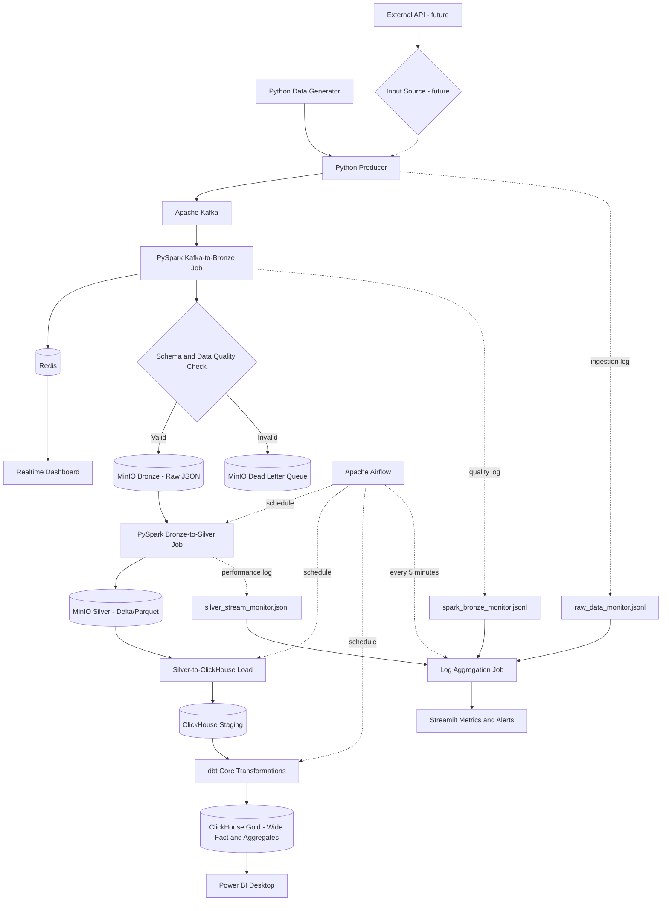

# Realtime E-commerce Data Platform Architecture

> **Trạng thái tài liệu:** Đây là bản thiết kế ban đầu (initial design), dùng để định hướng triển khai chứ không phải kiến trúc cố định. Khi thực hiện từng giai đoạn, các thành phần, luồng xử lý, schema, cách phân vùng, công nghệ và quy tắc vận hành có thể được xem xét lại dựa trên kết quả kiểm thử và nhu cầu thực tế.

> **Theo dõi triển khai:** xem [Project implementation status](project-status.md) để biết cổng nào đã được kiểm chứng runtime, giới hạn hiện tại và bước tiếp theo.

> **Spark runtime hiện hành — 2026-09-25:** chuẩn hóa từ Spark 4.2.0 xuống `4.0.4-scala2.13-java17-python3-ubuntu` để khớp nhánh được ClickHouse Spark connector công bố hỗ trợ. Kafka vẫn giữ phiên bản 4.2.0; hai version này độc lập. Các bằng chứng runtime cũ bên dưới được giữ nguyên là lịch sử Spark 4.2.0 và phải chạy regression lại trước khi công nhận trên Spark 4.0.4.

> **Validation v1:** xem [Schema parsing and validation design](schema-validation-design-v1.md) cho quyết định parser, rule catalog, output contract và tư duy hệ thống trước khi triển khai Kafka-to-Bronze/DLQ.

## 0. Nguyên tắc phát triển kiến trúc

### Quyết định hiện hành — 2026-09-23: ưu tiên project Data Engineering

Người dùng chốt giữ nguyên `create_data.py` hiện tại. Mục tiêu là project giả lập realtime để học và thể hiện năng lực thiết kế pipeline, phân tích trade-off, kiểm soát chất lượng, recovery và observability. Chưa cần mô phỏng đầy đủ hoạt động bán hàng thực tế.

- Nguồn hiện tại: 32 trường, mỗi record là một giao dịch/review giả lập độc lập, một sản phẩm; luồng append-only, không có cập nhật snapshot cấp đơn.
- Giữ kiến trúc Kafka → Spark → Bronze/DLQ → Silver → warehouse/Gold và các nhánh realtime/monitoring làm định hướng. Mỗi thành phần vẫn phải được đánh giá về mục đích, tài nguyên local và độ phức tạp trước khi triển khai.
- Không yêu cầu thêm orderItemID, eventID, snapshotVersion hoặc các thời điểm nghiệp vụ mới vào nguồn. Pipeline có thể bổ sung metadata ingestion và Kafka để truy vết.
- KPI là thống kê mô tả dữ liệu giả lập: số record, sản lượng, giá trị hàng, giá trị gắn nhãn thanh toán thành công, phân bố trạng thái, rating và chất lượng dữ liệu. Không coi các giá trị này là doanh thu kế toán hay tiền thu được đối soát.
- Thời gian review chỉ phục vụ phân tích review; thời gian ingestion phục vụ luồng realtime. Không suy ra ngày đặt hàng từ ngày review.
- Chấp nhận giới hạn của nguồn: ID sản phẩm ngẫu nhiên, thuộc tính cửa hàng không ổn định, brand/category và trạng thái độc lập. Không loại dữ liệu chỉ vì vi phạm các quy tắc business chưa được nguồn cam kết.
- Các null do inject_chaos là đầu vào có chủ đích cho kiểm thử chất lượng. Validator v1 đã chốt: null ở field bắt buộc là `INVALID/E006_REQUIRED_NULL` và sẽ được định tuyến DLQ; `reviewerName = null` vẫn hợp lệ.

**Lý do:** tập trung thời gian vào streaming, lưu trữ, xử lý lỗi và vận hành. **Trade-off:** dashboard có giá trị minh họa kỹ thuật, chưa thể kết luận về hành vi kinh doanh thực tế hoặc vòng đời đơn hàng. Nguồn có thể được nâng cấp sau bằng contract mới khi có nhu cầu cụ thể.

**Ưu tiên tài liệu:** quyết định này thay thế thiết kế snapshot trước đây. [Source data contract v1](source-data-contract-v1.md) là contract hiện hành. [Data contract snapshot](data-contract-v1.md) chỉ được giữ để tham khảo mở rộng.

**Điều chỉnh kế hoạch:** Giai đoạn 1 chỉ cần mô tả đúng 32 trường nguồn hiện tại, xác định null/quality rules và metadata downstream. Bỏ yêu cầu chờ đủ dòng của một đơn, version cấp đơn và đối soát snapshot. Giai đoạn Producer chỉ đánh giá vận hành nguồn hiện có; thay đổi cách sinh nguồn sẽ là công việc riêng nếu cần. Các bước hạ tầng/streaming tiếp theo vẫn thực hiện lần lượt, ghi rõ lý do chọn, phương án thay thế, trade-off và kết quả kiểm thử.

- Triển khai theo từng bước nhỏ và xác minh đầu ra của mỗi bước trước khi mở rộng.
- Không mặc định thiết kế ban đầu là phương án tối ưu cuối cùng.
- Sau mỗi giai đoạn cần đánh giá lại độ phức tạp, hiệu năng, tài nguyên máy và khả năng vận hành.
- Các edge case phát hiện trong quá trình triển khai phải được ghi nhận, kiểm thử và phản ánh lại vào thiết kế.
- Schema và data contract phải được version hóa khi có thay đổi làm ảnh hưởng producer hoặc consumer.
- Ưu tiên giải pháp đơn giản, có thể quan sát và tái lập được cho phạm vi project cá nhân.
- Chỉ bổ sung thành phần mới khi có nhu cầu hoặc bằng chứng kỹ thuật rõ ràng.
- Tài liệu này phải được cập nhật song song với những quyết định kiến trúc quan trọng.
- Mỗi bước phải giải thích thêm tư duy hệ thống: boundary/interface, nơi giữ state, failure mode, scaling/capacity, observability, security, trade-off và bằng chứng có thể trình bày trong CV/phỏng vấn.
- Không đánh đồng việc container `healthy` với việc luồng dữ liệu end-to-end đã đúng; mỗi interface và cơ chế recovery phải có cổng kiểm chứng riêng.

Các nội dung cần xem xét lại trong từng giai đoạn gồm:

- Dữ liệu thiếu, sai kiểu, trùng lặp, đến muộn hoặc sai thứ tự.
- Kafka retry, duplicate delivery, consumer restart và offset recovery.
- Schema evolution và khả năng tương thích ngược.
- Cách tổ chức partition và xử lý small files trong Bronze/Silver.
- Idempotency khi ghi MinIO, ClickHouse và khi chạy lại job.
- DLQ, khả năng replay dữ liệu lỗi và audit lineage.
- Backpressure, throughput, latency và giới hạn tài nguyên local.
- Chính sách retention, checkpoint, backup và khôi phục.
- Ngưỡng metric, cảnh báo và cách xử lý khi một service tạm ngừng.

## 0.1. Nguyên tắc ra quyết định theo business

Kiến trúc và công nghệ không được lựa chọn chỉ vì phổ biến hoặc có trong sơ đồ ban đầu. Trước mỗi giai đoạn, cần xác định nhu cầu business mà giai đoạn đó phục vụ. Mỗi quyết định phải trả lời được:

1. Business cần giải quyết vấn đề gì?
2. Ai là người sử dụng dữ liệu hoặc kết quả này?
3. Quyết định nào sẽ được đưa ra từ dữ liệu?
4. Dữ liệu cần mới đến mức nào: dưới một giây, vài giây, vài phút hay theo ngày?
5. Sai số, dữ liệu thiếu hoặc dữ liệu đến muộn được chấp nhận đến mức nào?
6. Khối lượng dữ liệu hiện tại và dự kiến là bao nhiêu?
7. Chi phí tài nguyên, độ phức tạp và thời gian vận hành có phù hợp project cá nhân không?
8. Giải pháp đơn giản hơn có đáp ứng đủ yêu cầu không?

Mỗi quyết định kỹ thuật phải được ghi lại tối thiểu theo mẫu:

```text
Decision:
Business requirement:
Options considered:
Selected option:
Why selected:
Trade-offs accepted:
Risks:
Validation method:
Revisit condition:
```

## 0.2. Yêu cầu business cần làm rõ

Baseline được người dùng đồng ý ngày 2026-09-23 nằm ở mục 1.1. Các câu hỏi dưới đây là checklist ban đầu; nội dung đã được baseline giải quyết không cần hỏi lại. Những nội dung còn lại được chốt theo từng giai đoạn.

### Người dùng và use case

- Ai sử dụng realtime dashboard?
- Ai sử dụng Power BI và họ cần đưa ra quyết định gì?
- Dashboard phục vụ quan sát hệ thống, phân tích bán hàng hay cả hai?
- Có cần hỗ trợ dữ liệu từ API thật ngoài script mô phỏng không?

### KPI nghiệp vụ

Các KPI có thể cần xác nhận gồm:

- Doanh thu và số lượng đơn hàng.
- Giá trị đơn hàng trung bình.
- Doanh thu theo thời gian, sản phẩm, thương hiệu, cửa hàng và khu vực.
- Tỷ lệ thanh toán thành công/thất bại.
- Tỷ lệ giao thành công, đang vận chuyển và hoàn hàng.
- Điểm review trung bình và tỷ lệ review tiêu cực.
- Mức độ hữu ích của review.
- Tỷ lệ dữ liệu hợp lệ, lỗi hoặc phải đưa vào DLQ.

Mỗi KPI phải có định nghĩa thống nhất. Ví dụ, doanh thu được tính từ mọi đơn hàng hay chỉ đơn thanh toán thành công; đơn hoàn hàng có bị trừ doanh thu hay không.

### Quy tắc nghiệp vụ

Trước khi xây Silver và Gold cần chốt:

- Khi nào một đơn hàng được tính vào doanh thu?
- Xử lý đơn thanh toán thất bại, đang xử lý hoặc hoàn hàng như thế nào?
- Một order có thể có nhiều sản phẩm hay mỗi event đại diện cho một dòng sản phẩm?
- `orderID`, `paymentID`, `shippingID` có duy nhất tuyệt đối không?
- Review gắn với sản phẩm, đơn hàng hay cả hai?
- Có cho phép review trước khi giao hàng thành công không?
- Giá, số lượng và tổng tiền âm hoặc bằng không được xử lý thế nào?
- Bản ghi trùng được nhận diện bằng khóa nào?
- Dữ liệu đến muộn được cập nhật lại trong khoảng thời gian bao lâu?
- Bản ghi sửa đổi được update, append phiên bản mới hay bỏ qua?

### Freshness và SLA

Cần xác định riêng cho từng đầu ra:

- Độ trễ chấp nhận được của realtime dashboard.
- Tần suất cập nhật Silver.
- Tần suất load ClickHouse và chạy dbt.
- Tần suất refresh Power BI.
- Thời gian cho phép để phát hiện và cảnh báo lỗi pipeline.

### Chất lượng dữ liệu

Cần xác định:

- Trường bắt buộc và trường được phép null.
- Khoảng giá trị hợp lệ của rating, giá, số lượng và thời gian.
- Ngưỡng tỷ lệ lỗi để cảnh báo hoặc tạm dừng pipeline.
- Bản ghi lỗi nào được sửa tự động và bản ghi nào phải vào DLQ.
- Điều kiện và quy trình replay dữ liệu từ DLQ.

### Dữ liệu và quản trị

- Thời gian lưu dữ liệu ở Kafka, Bronze, Silver, Gold và DLQ.
- Có dữ liệu cá nhân nào cần che, hash hoặc loại bỏ không?
- Có cần audit lịch sử thay đổi dữ liệu không?
- Cần backup và khôi phục đến mức nào cho project cá nhân?
- Dataset mô phỏng có cần giữ tính nhất quán giữa category, brand, product và trạng thái đơn hàng không?

## 0.3. Definition of Done cho mỗi giai đoạn

Một giai đoạn chỉ được xem là hoàn thành khi:

- Yêu cầu business liên quan đã được ghi rõ.
- Có data contract hoặc interface đầu vào/đầu ra.
- Giải pháp được chọn có lý do và trade-off được ghi nhận.
- Happy path và các edge case thuộc phạm vi đã được kiểm thử.
- Có cách quan sát lỗi và xác minh kết quả.
- Tài liệu kiến trúc được cập nhật theo triển khai thực tế.
- Người thực hiện xác nhận kết quả trước khi chuyển sang giai đoạn kế tiếp.

## 1. Mục tiêu

Hệ thống mô phỏng và xử lý dữ liệu thương mại điện tử theo thời gian thực. Dữ liệu được đưa qua Kafka, xử lý bằng Spark Structured Streaming, lưu theo mô hình Bronze/Silver/Gold và phục vụ hai loại dashboard:

- Dashboard realtime đọc dữ liệu mới nhất từ Redis.
- Dashboard BI đọc dữ liệu Gold từ ClickHouse.

Toàn bộ hạ tầng được thiết kế để chạy local bằng Docker Compose, không phụ thuộc các dịch vụ AWS trả phí.

## 1.1. Bài toán và dữ liệu hiện hành

**Bài toán:** xây dựng một nền tảng dữ liệu realtime hoàn chỉnh trên dữ liệu thương mại điện tử giả lập, nhằm thể hiện cách ingest, kiểm tra chất lượng, phân luồng lỗi, xử lý streaming, tổ chức Bronze/Silver/Gold, phục vụ dashboard và quan sát vận hành.

**Trọng tâm đánh giá:** kiến trúc, khả năng truy vết, xử lý lỗi, retry/recovery, idempotency kỹ thuật, hiệu năng, tài nguyên local và trade-off giữa các lựa chọn. Dashboard business dùng để chứng minh dữ liệu đã đi hết pipeline và có thể khai thác.

**Grain:** một record là một quan sát giao dịch-review giả lập độc lập gồm đúng một sản phẩm, một orderID, một paymentID và một shippingID. Record được append một lần; nguồn không phát phiên bản mới cho cùng orderID.

**Nguồn:** `create_data.py` sinh 32 trường. Khoảng 15% record được cố ý đặt null tại một trong ba trường `reviewerID`, `asin`, `overall`; `reviewerName` cũng có thể null hợp lệ. Ngày 2023–2024 là ngày review, không phải ngày đặt hàng.

| Chỉ số minh họa | Định nghĩa trong phạm vi dữ liệu giả lập |
|---|---|
| Số record/đơn giả lập | Đếm record hợp lệ; mỗi record hiện có orderID mới |
| Sản lượng | Tổng `quantity` |
| Giá trị hàng giả lập | Tổng `totalAmount` |
| Giá trị gắn nhãn thanh toán thành công | Tổng `totalAmount` khi `paymentStatus = Thành công` |
| Phân bố trạng thái | Đếm record theo payment/shipping status |
| Rating trung bình | Trung bình `overall` không null của record hợp lệ |
| Chất lượng dữ liệu | Số/tỷ lệ record hợp lệ, cảnh báo và DLQ |
| Throughput/latency | Tính theo metadata Kafka và thời gian ingestion |

Các chỉ số tiền không đại diện doanh thu kế toán hoặc tiền đã đối soát. Trạng thái thanh toán và giao hàng chỉ là nhãn trong record, không phải lịch sử vòng đời đơn hàng. Không dùng `reviewTime` làm thời gian bán hàng.

**Giới hạn được chấp nhận:** một đơn một sản phẩm; không có order event time; không có cập nhật trạng thái; brand/category và payment/shipping status có thể không hợp lý theo business; ID sản phẩm được tạo mới; cùng storeID có thể có tên khác nhau. Các vấn đề này được ghi nhận để phân biệt lỗi nguồn với lỗi pipeline.

Contract hiện hành là [source-data-contract-v1.md](source-data-contract-v1.md). Contract snapshot nhiều dòng tại [data-contract-v1.md](data-contract-v1.md) đã hoãn đến khi có yêu cầu nâng cấp nguồn.

## 1.2. Ảnh hưởng đến file triển khai

| File/thành phần | Quyết định hiện tại |
|---|---|
| `create_data.py` | Giữ nguyên schema và logic sinh 32 trường; chưa thêm snapshot, eventID hoặc order event time |
| `architecture/source-data-contract-v1.md` | Contract nguồn hiện hành, làm cơ sở viết JSON Schema và validator |
| `architecture/data-contract-v1.md` | Tài liệu mở rộng đã hoãn, không dùng cho implementation hiện tại |
| Kafka-to-Bronze job | Sẽ đọc đúng 32 trường, bổ sung Kafka metadata, phân loại VALID/WARNING/INVALID và route INVALID vào DLQ |
| Bronze-to-Silver job | Sẽ chuẩn hóa tên/kiểu, giữ quality flags và loại trùng kỹ thuật theo topic-partition-offset |
| Redis/dashboard realtime | Sẽ hiển thị metric event và pipeline, không mô phỏng vòng đời đơn |
| ClickHouse/dbt/Power BI | Dùng wide event fact và aggregate OLAP; chưa xây master product/store |
| Monitoring | Sẽ bổ sung lại module còn thiếu theo contract log riêng; lỗi monitoring không được làm dừng producer |

Các file triển khai downstream chưa tồn tại sẽ được tạo ở đúng giai đoạn. Không sửa producer để đáp ứng thiết kế nguồn đã hoãn.

## 2. Sơ đồ kiến trúc

Sơ đồ là định hướng ban đầu. API và công tắc nguồn là khả năng mở rộng; luồng triển khai hiện tại bắt đầu từ Python Data Generator.



## 3. Technology stack

| Chức năng | Công nghệ | Vai trò |
|---|---|---|
| Data generation | Python, Faker | Sinh giao dịch thương mại điện tử giả lập |
| Ingestion | Python Producer | Chuẩn hóa và gửi event vào Kafka |
| Message streaming | Apache Kafka (KRaft) | Lưu và phân phối event realtime |
| Stream processing | PySpark Structured Streaming | Đọc Kafka, kiểm tra dữ liệu và xử lý các tầng dữ liệu |
| Realtime serving | Redis | Lưu metric hoặc dữ liệu mới nhất cho dashboard realtime |
| Object storage | MinIO | Thay thế S3 cho Bronze, Silver và DLQ |
| Lake format | Delta Lake hoặc Parquet | Lưu dữ liệu Silver có schema và hỗ trợ xử lý tăng dần |
| OLAP warehouse | ClickHouse | Columnar staging/Gold cho dữ liệu tăng lớn và dashboard aggregate |
| Data transformation | dbt Core | Xây dựng Fact, Dimension và data mart |
| Orchestration | Apache Airflow | Lập lịch các job batch, load, dbt và tổng hợp log |
| Monitoring | JSONL, Python, Streamlit | Thu thập metric, tổng hợp log và hiển thị cảnh báo |
| BI | Power BI Desktop | Phân tích dữ liệu trong ClickHouse Gold |
| Runtime | Docker Compose | Khởi tạo và kết nối các service local |

## 4. Luồng dữ liệu chính

### 4.1 Ingestion

1. `create_data.py` sinh một record JSON giả lập mỗi khoảng 0,5 giây.
2. Producer vừa append JSON vào file local vừa gửi cùng payload vào Kafka.
3. Kafka gắn topic, partition, offset và timestamp để truy vết record.
4. Monitoring của producer sẽ ghi metric ingestion vào `raw_data_monitor.jsonl` khi được triển khai.

API và Input Source Switch thuộc hướng mở rộng, chưa nằm trong luồng chạy hiện tại.

Kafka topic mặc định:

```text
ecommerce_reviews
```

### 4.2 Kafka to Bronze

PySpark Structured Streaming đọc event từ Kafka và thực hiện:

1. Parse JSON theo schema xác định trước.
2. Bổ sung metadata như thời gian ingestion, Kafka partition và offset.
3. Kiểm tra các trường bắt buộc và kiểu dữ liệu.
4. Gửi dữ liệu mới nhất hoặc metric tổng hợp vào Redis.
5. Ghi bản ghi hợp lệ vào MinIO Bronze.
6. Ghi bản ghi không hợp lệ vào MinIO Dead Letter Queue.
7. Ghi kết quả kiểm tra chất lượng vào `spark_bronze_monitor.jsonl`.

Quy tắc đầy đủ nằm trong [source-data-contract-v1.md](source-data-contract-v1.md). Các trường cốt lõi của record hiện tại:

```text
asin
orderID
unitPrice
quantity
totalAmount
paymentStatus
shippingStatus
unixReviewTime
```

Record lỗi cấu trúc, thiếu trường bắt buộc, sai kiểu hoặc null tại `reviewerID`/`asin`/`overall` được đưa vào DLQ. `reviewerName = null` là hợp lệ. Tổ hợp brand/category hoặc payment/shipping thiếu hợp lý về business chỉ được gắn cảnh báo vì nguồn hiện tại không cam kết các quan hệ đó.

### 4.3 Bronze to Silver

Job Bronze-to-Silver đọc dữ liệu hợp lệ và thực hiện:

- Chuẩn hóa tên cột từ camelCase sang snake_case.
- Ép kiểu dữ liệu.
- Loại trùng kỹ thuật theo `(kafka_topic, kafka_partition, kafka_offset)` trong cùng lần ingest/recovery. Nguồn chưa có eventID nên không cam kết phát hiện trùng business khi cùng payload được gửi lại với offset mới.
- Chuẩn hóa timestamp.
- Kiểm tra `total_amount = unit_price * quantity`; dữ liệu không khớp phải có lý do lỗi, không âm thầm ghi đè giá trị nguồn.
- Ghi dữ liệu dạng Delta Lake hoặc Parquet vào MinIO Silver.
- Ghi metric tốc độ và thời gian xử lý vào `silver_stream_monitor.jsonl`.

Phân vùng Silver dự kiến:

```text
silver/ecommerce_reviews/ingestion_date=YYYY-MM-DD/
```

### 4.4 Silver to Gold

1. Dữ liệu Silver được load vào database logic `staging` của ClickHouse.
2. dbt Core kiểm tra và biến đổi dữ liệu staging.
3. Kết quả được ghi vào schema `gold`.
4. Power BI Desktop kết nối ClickHouse để đọc Gold wide fact/aggregate.

Mô hình Gold ClickHouse v1:

```text
gold.fact_ecommerce_events
gold.agg_ecommerce_daily
gold.dim_date
```

Không tách `fact_reviews` vì review và giao dịch hiện có cùng grain 1–1. Chưa tạo `fact_data_quality` vì Silver không chứa INVALID; quality fact cần nguồn Bronze/DLQ riêng. ClickHouse ưu tiên wide fact để giảm join ở quy mô lớn; chưa tạo `dim_product` hoặc `dim_store` chuẩn vì ID/thuộc tính nguồn hiện không ổn định như master data. Chi tiết tại [ClickHouse staging và dbt Gold design v1](clickhouse-gold-design-v1.md).

## 5. Các tầng lưu trữ

### Bronze

- Lưu event JSON gần với dữ liệu gốc nhất.
- Chỉ nhận bản ghi vượt qua kiểm tra schema tối thiểu.
- Giữ metadata Kafka để có thể truy vết và xử lý lại.

### Dead Letter Queue

- Lưu dữ liệu lỗi schema, thiếu trường bắt buộc hoặc không ép được kiểu.
- Mỗi bản ghi phải kèm lý do lỗi và thời gian phát hiện.
- Dữ liệu DLQ không được đưa trực tiếp sang Silver.

### Silver

- Dữ liệu đã làm sạch và chuẩn hóa kiểu.
- Tên cột sử dụng snake_case.
- Có thể được xử lý tăng dần theo thời gian hoặc Kafka offset.

### Gold

- Dữ liệu được mô hình hóa thành Fact và Dimension.
- Phục vụ truy vấn phân tích và Power BI.
- Không chứa JSON thô hoặc dữ liệu lỗi từ DLQ.

## 6. Realtime dashboard

Redis chỉ giữ dữ liệu cần truy vấn nhanh, ví dụ:

- Tổng số event đã nhận.
- Tổng giá trị hàng giả lập và giá trị có nhãn thanh toán thành công.
- Số record theo trạng thái thanh toán/giao hàng.
- Điểm review trung bình.
- Số bản ghi hợp lệ và lỗi.
- Danh sách giao dịch mới nhất.

Realtime Dashboard không thay thế Power BI. Nó phục vụ trạng thái tức thời, trong khi Power BI đọc mô hình Gold để phân tích lịch sử.

## 7. Observability và monitoring

Hệ thống có ba nguồn log độc lập:

| File | Nguồn | Nội dung chính |
|---|---|---|
| `raw_data_monitor.jsonl` | Producer | Thời gian ingestion, trạng thái gửi và thông tin input |
| `spark_bronze_monitor.jsonl` | Kafka-to-Bronze | Số bản ghi hợp lệ/lỗi và kết quả quality check |
| `silver_stream_monitor.jsonl` | Bronze-to-Silver | Throughput, latency và thời gian xử lý |

Airflow chạy Log Aggregation Job mỗi 5 phút. Job tổng hợp ba nguồn log thành metric gọn để Streamlit hiển thị:

- Throughput theo phút.
- Tỷ lệ dữ liệu lỗi.
- Processing latency.
- Kafka/Spark job status.
- Cảnh báo khi vượt ngưỡng.

## 8. Orchestration

Airflow chịu trách nhiệm cho các công việc định kỳ:

- Tổng hợp monitoring log mỗi 5 phút.
- Kiểm tra hoặc compact dữ liệu Silver.
- Load dữ liệu Silver vào ClickHouse.
- Chạy `dbt run` và `dbt test`.

Producer và job Kafka-to-Bronze là tiến trình realtime chạy liên tục, không được Airflow khởi chạy cho từng event.

## 9. Ánh xạ từ kiến trúc AWS sang local

| Kiến trúc ban đầu | Kiến trúc local |
|---|---|
| Amazon Kinesis | Apache Kafka |
| Amazon S3 | MinIO |
| DynamoDB | Redis |
| Amazon Redshift | ClickHouse OSS single-node |
| AWS Glue Data Catalog | Metadata từ Delta/Parquet; có thể bổ sung Hive Metastore khi cần |
| Managed Airflow | Apache Airflow local |
| Power BI Service | Power BI Desktop |

## 10. Nguyên tắc vận hành

- Mỗi event phải có khả năng truy vết từ Kafka đến Bronze, Silver và Gold.
- Dữ liệu lỗi phải vào DLQ, không được âm thầm bỏ qua.
- Producer không phụ thuộc dashboard hoặc data warehouse.
- Realtime pipeline và batch orchestration phải có thể chạy độc lập.
- Thông tin kết nối và mật khẩu chỉ được đặt trong `.env`, không commit vào Git.
- Mọi service local được khởi tạo và kết nối thông qua Docker Compose.

## 11. Kế hoạch triển khai tuần tự

Các giai đoạn dưới đây được thực hiện lần lượt. Không triển khai trước thành phần của giai đoạn sau nếu giai đoạn hiện tại chưa qua cổng xác nhận.

### Giai đoạn 1: Chốt phạm vi và source data contract

**Mục tiêu:** mô tả chính xác dữ liệu mà `create_data.py` đang phát và phân biệt validation kỹ thuật, lỗi chất lượng có chủ đích và cảnh báo business.

**Cần quyết định:**

- Kiểu và nullability của 32 trường nguồn.
- Lỗi nào vào DLQ và vấn đề nào chỉ tạo cảnh báo.
- Metadata nào được pipeline bổ sung để truy vết.
- Giới hạn KPI do không có order event time, eventID và lịch sử trạng thái.

**Đầu ra:** source data contract v1, JSON Schema tương ứng và bộ dữ liệu mẫu hợp lệ/DLQ/cảnh báo.

**Cổng hoàn thành:** mọi trường có type/nullability; mỗi lỗi mẫu có kết quả định tuyến xác định; tài liệu không yêu cầu trường mà producer hiện tại không phát.

**Trạng thái — đạt:** contract 32 trường, JSON Schema, ba mẫu chính và ba edge case đã được Spark validator kiểm chứng. Application `app-20260924045552-0000` trả đúng sáu kết quả VALID/WARNING/INVALID; không cần thay đổi `create_data.py`.

### Giai đoạn 2: Chuẩn hóa project và môi trường local

**Mục tiêu:** tạo nền tảng có thể tái lập trước khi xây pipeline.

**Cần quyết định:**

- Service nào chạy trong Docker, service nào chạy từ virtual environment.
- Phiên bản Python, Java, Kafka, Spark và format lake.
- Cách quản lý biến môi trường, volume và network.

**Trade-off cần đánh giá:** chạy tất cả trong Docker dễ tái lập nhưng tốn RAM và khó debug hơn; chạy một phần trên host nhẹ hơn nhưng phụ thuộc môi trường máy.

**Đầu ra:** cấu trúc thư mục, `.env.example`, dependency files, Docker Compose tối thiểu và hướng dẫn kiểm tra môi trường.

**Cổng hoàn thành:** từng service nền tảng có health check rõ ràng và có thể khởi động/dừng độc lập.

**Quyết định v1:** producer chạy trong Windows venv; Kafka, Spark, MinIO, Redis, ClickHouse và Airflow chạy bằng Docker theo profile; Power BI chạy trên Windows. Chọn Parquet cho lake v1, hoãn Delta Lake đến khi có nhu cầu update/upsert/transaction. Xem [local environment design](local-environment-design.md).

**Trạng thái hiện tại:** Docker Desktop và core profile đã được kiểm chứng với Kafka, MinIO, Spark master/worker; Redis cũng đã có runtime gate lịch sử. ClickHouse và Airflow chưa được thêm vì chưa qua cổng warehouse/orchestration.

**Kafka core đã cấu hình:** `.env.example`, `docker-compose.yml`, named volume, health check, external/internal listener và [Kafka local runbook](kafka-local-runbook.md) đã được tạo. Cấu hình được kiểm tra tĩnh trước khi người dùng tự chạy.

**Runtime checkpoint 2026-09-23 — đạt:** người dùng đã xác nhận producer kết nối Kafka, topic `ecommerce_reviews` có 10 partition, replication factor 1, retention một ngày và toàn bộ partition có leader/ISR. Sau `docker compose down → up`, container trở lại `healthy` và console consumer đọc được ba message cũ qua `kafka:29092`. Producer → Kafka → consumer, dual listener và named-volume persistence đều đã được kiểm chứng thủ công. Kafka core hoàn thành.

**Quyết định object storage 2026-09-23, cập nhật registry 2026-09-25:** dùng MinIO Community legacy `RELEASE.2025-04-22T22-12-26Z` single-node cho project local vì S3 API, độ phổ biến và Console đầy đủ. Sau runtime reset, Quay trả 401 và Docker Hub legacy không còn pull được; Compose chuyển sang Coollabs community build từ source MinIO trên GHCR, pin manifest digest và dùng cùng image cho server/`mc`. Binary runtime đã xác nhận đúng MinIO `RELEASE.2025-04-22T22-12-26Z` và `mc` `RELEASE.2025-08-13T08-35-41Z`. Trade-off: legacy, third-party build, không còn cập nhật và không phù hợp production. `docker-compose.yml` có `minio`, init container tạo `bronze`/`silver`/`dlq`, health check và named volume; runtime/persistence trước reset đã đạt ở các checkpoint bên dưới.

**MinIO runtime checkpoint 2026-09-23 — khởi tạo đạt:** người dùng đã xác nhận server `healthy`, init container `Exited (0)`, log tạo đủ `bronze`/`silver`/`dlq` và Console hiển thị ba bucket. Lần thử persistence đầu chưa hợp lệ vì `docker compose down` không bật profile `streaming`, khiến MinIO không bị xóa (`Resource is still in use`, tuổi container không đổi). Còn kiểm tra lại bằng `docker compose --profile streaming down` trước khi đóng cổng object storage và thiết kế Spark.

**MinIO persistence checkpoint 2026-09-23 — đạt:** người dùng đã xóa và tạo lại container MinIO bằng profile `streaming`, sau đó xác nhận ba bucket vẫn còn trên Console. Named volume giữ được state; cổng object storage hoàn thành.

**Spark runtime design 2026-09-23:** chọn Spark Standalone 4.2.0 gồm một master và một worker 2 core/2 GB trong profile `streaming`. Đây là topology học scheduling/executor, không tuyên bố HA. Compose và [Spark local runbook](spark-local-runbook.md) đã được thêm; runtime đã đạt ở checkpoint bên dưới.

**Spark runtime checkpoint 2026-09-24 — đạt:** master và worker đều `healthy`; Master UI hiển thị một worker `ALIVE` với đúng 2 cores/2 GiB. Smoke test `app-20260923172156-0000` chạy bốn partition trên executor và trả đúng `row_count=100000`, `id_sum=5000050000`. File và mount test tạm thời đã được xóa sau khi kiểm chứng; bước tiếp theo là thiết kế kết nối Spark → Kafka.

**Spark → Kafka connectivity design 2026-09-24:** dùng batch read có điểm kết thúc qua `kafka:29092`, đọc snapshot `earliest` đến `latest` và chỉ kiểm tra raw payload cùng Kafka metadata. Connector pin `spark-sql-kafka-0-10_2.13:4.2.0`; chưa parse schema, chưa ghi MinIO và chưa tạo streaming checkpoint. Xem [Spark-to-Kafka connectivity test](spark-kafka-connectivity.md).

**Spark → Kafka connectivity checkpoint 2026-09-24 — đạt:** sau khi chuyển Ivy cache khỏi `/nonexistent` sang `/tmp/.ivy2`, application `app-20260923174010-0000` đọc được 39 message trên đủ 10 partition qua `kafka:29092`, gồm raw payload và Kafka metadata. File smoke test đã được xóa; source mount được giữ cho pipeline thật. Bước kế tiếp là thiết kế schema parsing và validation trước khi ghi Bronze/DLQ.

**Schema/validation checkpoint 2026-09-24 — đạt:** application `app-20260924045552-0000` chạy reusable native Spark transformation trên sáu case và trả `CONTRACT_VALIDATION_OK`. VALID không có flag; WARNING có đúng W101/W102; null bắt buộc, malformed, missing field và wrong type lần lượt ra đúng E006/E001/E003/E005. Chưa kết nối validator với Kafka trong cùng application và chưa kết nối S3A/MinIO.

**Bounded Kafka + validation integration 2026-09-24 — implementation ready, chờ runtime:** đã thêm job batch đọc snapshot `earliest` → `latest`, giữ Kafka lineage và chạy cùng validator đã regression-test. Gate kiểm tra one-input/one-output, lineage duy nhất, status/error consistency và tổng hợp quality rule; không ghi raw payload ra log. Đồng thời chốt `SOURCE_TIME_ZONE=Asia/Ho_Chi_Minh` vì generator tạo `reviewTime` bằng local time; dùng UTC ngầm có thể gây lỗi giả gần ranh giới ngày. Cổng này cố ý chưa thêm S3A, MinIO write hoặc streaming checkpoint để failure domain còn hẹp. Xem [bounded Kafka validation runbook](kafka-validation-integration.md).

**Bounded Kafka + validation runtime checkpoint 2026-09-24 — đạt:** application `app-20260924084421-0001` bảo toàn 168 input thành 168 output với 168 lineage duy nhất, phủ đủ 10 partition và trả `KAFKA_VALIDATION_OK`. Quality profile gồm 27 VALID, 116 WARNING, 25 INVALID; toàn bộ INVALID là `E006_REQUIRED_NULL` do chaos injection đã biết. Không có structural/type/cross-field error khác. Cổng tiếp theo là thiết kế physical Bronze/DLQ write, checkpoint và multi-sink idempotency; chưa tuyên bố streaming recovery hay exactly-once.

**Rule taxonomy clarification 2026-09-24:** validation được tách thành technical parsing, schema/data contract, domain constraint, cross-field consistency và business warning. Không coi mọi type/null/range check là business rule. Vi phạm contract chắc chắn thành `INVALID`; anomaly chưa đủ bằng chứng nghiệp vụ thành `WARNING` để tránh loại nhầm dữ liệu.

**Bronze/DLQ physical storage design 2026-09-24:** giữ Parquet cho v1; Bronze chứa VALID/WARNING, DLQ chứa INVALID; layout partition theo ingestion date và checkpoint tách khỏi data bucket. Chọn hai streaming query với checkpoint riêng để tránh partial two-sink write trong một `foreachBatch`, chấp nhận đọc/validate hai lần ở volume local. Trước khi triển khai stream, thêm gate Spark ↔ MinIO ghi/đọc/xóa Parquet qua S3A; test dùng UUID path và tự cleanup. Xem [Bronze/DLQ storage design v1](bronze-dlq-storage-design-v1.md).

**Spark ↔ MinIO S3A runtime checkpoint 2026-09-24 — đạt:** application `app-20260924090739-0000` ghi 100 row thành hai Parquet file vào path UUID trong bucket Bronze, đọc lại đúng count/sum rồi xóa path và trả `cleanup=true`. Dependency, container network/DNS, credentials, permission và Parquet I/O đã được kiểm chứng. Cảnh báo SLF4J binding được ghi nhận là logging/classpath tech debt; chưa ảnh hưởng I/O. Bước kế tiếp là triển khai và kiểm thử Bronze/DLQ Structured Streaming với checkpoint riêng.

**Bronze/DLQ streaming implementation 2026-09-24 — ready, chờ runtime:** đã thêm bucket `checkpoints` và một Spark application gồm hai query độc lập cho Bronze và DLQ. Mỗi query có checkpoint S3A riêng; lần đầu đọc earliest, restart dùng checkpoint. Partition date lấy từ Kafka timestamp để deterministic khi retry. Local sink coalesce một partition/trigger để giảm small files, chấp nhận giới hạn throughput. Initial run, physical reconciliation và restart/resume là ba runtime gate riêng; chưa tuyên bố exactly-once. Xem [Bronze/DLQ streaming runbook](bronze-dlq-streaming-runbook.md).

**Bronze/DLQ initial materialization checkpoint 2026-09-24 — đạt:** MinIO có Parquet và `_spark_metadata` ở cả hai sink; checkpoint Bronze/DLQ đều có `sources`, `offsets`, `commits`, `metadata` cho batch 0–4. Hai commit mới nhất chứa cùng end offsets trên 10 Kafka partition; initial offsets đều 0 và tổng end offsets bằng 231 record. Mỗi sink có sáu Parquet file trên hai ingest date. Physical row/lineage reconciliation và restart/resume vẫn là các cổng riêng chưa đạt.

**Physical reconciliation implementation 2026-09-24 — ready, chờ runtime:** batch verifier đọc snapshot Kafka và committed Parquet, đối soát count, unique/disjoint lineage, missing/extra offsets, raw-payload SHA-256, routing status, contract version và deterministic partition date. Verifier read-only và yêu cầu producer/stream dừng để tránh race. Restart/resume chỉ được kiểm thử sau khi reconciliation đạt.

**Physical reconciliation runtime checkpoint 2026-09-24 — đạt:** application `app-20260924103733-0001` đối soát 231 Kafka record với 195 Bronze + 36 DLQ; sink union có 231 lineage duy nhất, không missing/extra/overlap và không payload hash mismatch. Physical status là 35 VALID, 160 WARNING, 36 INVALID; inventory có 6 Parquet file mỗi sink. Cổng tiếp theo là restart/resume để chứng minh checkpoint chỉ xử lý delta mới.

**Checkpoint restart/resume test design 2026-09-24 — ready:** test hai pha dùng baseline 231 record. Pha A restart không có input mới và yêu cầu count/file giữ nguyên; pha B restart, phát delta rồi yêu cầu reconciliation toàn bộ vẫn đạt và count chỉ tăng theo Kafka. Streaming marker bổ sung persistent query ID cùng per-run run ID để phân biệt logical query với execution mới. Xem [Checkpoint restart/resume test](checkpoint-restart-resume-test.md).

**Checkpoint restart observation 2026-09-24 — partial:** restart application `app-20260924110503-0002` và reconciliation `app-20260924112115-0003` cho thấy Kafka/sinks tăng từ 231 lên 305 record. Delta 74 được route thành +65 Bronze/+9 DLQ; 305 lineage vẫn duy nhất, không missing/extra/overlap/payload mismatch, file count tăng từ 6 lên 11 mỗi sink. Đây là bằng chứng xử lý delta sau restart, nhưng no-input control chưa hợp lệ vì Kafka đã nhận thêm event. Baseline mới là 305 record/11 file mỗi sink.

**Checkpoint backlog observation 2026-09-24 — cần catch-up:** reconciliation `app-20260924112720-0004` thấy Kafka 334 nhưng sinks 305 và báo thiếu đúng 29 Kafka lineage. Producer/source đã tiếp tục ghi sau khi stream dừng; đây là backlog được Kafka giữ lại, không phải duplicate do checkpoint. Phải dừng producer, resume stream bằng checkpoint để sinks bắt kịp 334, reconciliation lại thành công, rồi mới chạy no-input restart trên snapshot ổn định mới.

**Checkpoint identity observation 2026-09-24 — đạt, catch-up chưa đạt:** application `app-20260924113040-0005` giữ nguyên hai query ID so với run trước và tạo run ID mới, chứng minh Spark mở lại đúng checkpoint. Reconciliation `app-20260924113120-0006` vẫn thấy Kafka 334/sinks 305/missing 29 vì chưa có micro-batch catch-up được commit trước khi stream dừng. Marker STARTED không phải completion signal; lần kế tiếp phải quan sát commit/offset progress của cả hai query trước khi dừng.

**Checkpoint catch-up checkpoint 2026-09-24 — đạt:** application `app-20260924114510-0007` commit đúng 29 backlog record ở batch 10 cho cả hai query; batch 11 có 0 input và end offsets giữ nguyên tổng 334. Reconciliation `app-20260924114655-0008` đạt Kafka 334 = Bronze 286 + DLQ 48, 334 lineage duy nhất, không missing/extra/overlap/payload mismatch và 12 file mỗi sink. Baseline ổn định mới là 334/286/48/12/12; chỉ còn no-input restart control để đóng gate no-replay.

**Checkpoint no-input/no-replay checkpoint 2026-09-24 — đạt:** sau restart khi producer dừng, reconciliation `app-20260924115406-0010` giữ nguyên Kafka 334, Bronze 286, DLQ 48 và 12 file mỗi sink; 334 lineage vẫn duy nhất và mọi chỉ số missing/extra/overlap/payload mismatch bằng 0. Giai đoạn Kafka-to-Bronze/DLQ đạt đủ initial materialization, physical reconciliation, delta catch-up và controlled no-replay restart. Chưa suy rộng thành exactly-once end-to-end hoặc disaster recovery.

### Giai đoạn 3: Làm cứng Producer hiện tại

**Mục tiêu:** giữ nguyên logic sinh 32 trường nhưng gửi dữ liệu tin cậy, có cấu hình và có thể quan sát.

**Cần quyết định:**

- Delivery semantics, retry, message key và partition strategy.
- Vai trò của file JSONL local so với Kafka và cách tránh hiểu cả hai là hai nguồn sự thật.
- Cách ghi monitoring mà không làm producer dừng khi monitoring lỗi.

**Trade-off cần đánh giá:** ghi thêm JSONL hỗ trợ debug/replay nhưng tạo hai nguồn dữ liệu và tăng I/O.

**Đầu ra:** producer hiện tại có cấu hình, delivery handling, graceful shutdown và monitoring; không thay đổi schema/business generator.

**Cổng hoàn thành:** gửi được event hợp lệ/lỗi có chủ đích, xác minh được message trong Kafka và không mất message khi dừng bình thường.

### Giai đoạn 4: Kafka và hợp đồng streaming

**Mục tiêu:** vận hành luồng event ổn định giữa producer và consumer.

**Cần quyết định:**

- Số partition dựa trên throughput và ordering requirement.
- Kafka message key.
- Retention, replication factor cho local và offset reset policy.
- Cách xử lý duplicate, retry và consumer restart.

**Trade-off cần đánh giá:** nhiều partition tăng khả năng song song nhưng làm mất ordering toàn cục và tăng độ phức tạp.

**Đầu ra:** topic configuration, consumer kiểm chứng và kịch bản recovery.

**Cổng hoàn thành:** chứng minh được ordering trong phạm vi đã chọn, restart consumer không làm mất dữ liệu và duplicate có thể được nhận diện.

### Giai đoạn 5: Kafka-to-Bronze và DLQ

**Mục tiêu:** đưa raw event vào data lake với khả năng truy vết đầy đủ.

**Cần quyết định:**

- Validation nào chặn dữ liệu và validation nào chỉ cảnh báo.
- Định dạng Bronze, partition layout và kích thước file mục tiêu.
- Cấu trúc record trong DLQ và cơ chế replay.
- Checkpoint và idempotency khi Spark restart.

**Trade-off cần đánh giá:** kiểm tra nghiêm ngặt bảo vệ dữ liệu downstream nhưng có thể đẩy quá nhiều record vào DLQ; raw Bronze linh hoạt nhưng khó truy vấn hơn dữ liệu đã chuẩn hóa.

**Đầu ra:** Spark job, MinIO Bronze/DLQ, checkpoint và quality log.

**Cổng hoàn thành:** event hợp lệ và lỗi đi đúng nhánh, restart job không gây mất dữ liệu và có thể truy ngược về Kafka partition/offset.

**Runtime completion 2026-09-24 — đạt:** 334 Kafka record được phân tuyến thành 286 Bronze và 48 DLQ; lineage/payload reconciliation đạt, backlog được catch-up qua checkpoint và no-input restart không tạo thêm row hoặc file.

### Giai đoạn 6: Nhánh realtime với Redis

**Mục tiêu:** cung cấp dữ liệu có độ trễ thấp cho realtime dashboard.

**Cần quyết định:**

- Dashboard cần raw event mới nhất hay metric tổng hợp theo cửa sổ thời gian.
- Redis key design, TTL và giới hạn bộ nhớ.
- Độ trễ và mức mất dữ liệu tạm thời chấp nhận được.

**Trade-off cần đánh giá:** lưu raw event đơn giản nhưng khó truy vấn KPI; pre-aggregate đọc nhanh nhưng tăng logic và yêu cầu xử lý update chính xác.

**Đầu ra:** Redis data model, streaming write và dashboard realtime tối thiểu.

**Cổng hoàn thành:** KPI realtime khớp với tập event kiểm thử trong ngưỡng sai số và độ trễ đã chốt.

**Thiết kế v1 2026-09-24 — ready:** chọn Spark streaming job độc lập đọc Kafka để Redis failure không chặn Bronze/DLQ. Redis giữ metric ingestion-minute 48 giờ, summary, tối đa 100 event sanitized và batch marker; giới hạn 256 MiB với `noeviction`, AOF everysec và idempotency bằng Lua + batch ID. Freshness target local là 60 giây. Xem [Redis realtime serving design v1](redis-realtime-design-v1.md). Cổng kế tiếp chỉ dựng Redis container và kiểm tra health/auth/persistence trước khi viết sink.

**Redis runtime foundation implementation 2026-09-24 — ready, chờ runtime:** Compose đã thêm Docker Official Image `redis:8.10.2-alpine` trong profile `serving`, chỉ publish loopback, bật password, AOF everysec, maxmemory 256 MiB, `noeviction` và named volume. Chưa pull hoặc chạy container. Xem [Redis local runtime gate](redis-local-runbook.md).

**Redis runtime foundation checkpoint 2026-09-24 — đạt:** container healthy, unauthenticated access bị từ chối, authenticated PING thành công, memory/eviction/AOF đúng thiết kế và key test sống qua container recreation rồi được cleanup. Spark → Redis executor connectivity smoke test đã được thêm nhưng chưa chạy.

**Spark → Redis connectivity checkpoint 2026-09-24 — đạt:** application `app-20260924152156-0000` chạy một executor task qua internal DNS `redis:6379`, thực hiện AUTH/PING/SET/GET/DEL và trả `cleanup=true`. Cổng kế tiếp là kiểm chứng Lua batch marker chống double-count khi cùng batch bị retry.

**Redis Lua idempotency checkpoint 2026-09-24 — đạt:** application `app-20260924152421-0001` áp dụng cùng logical batch hai lần; Lua atomically cho lần đầu `1`, replay `0`, counter giữ ở `7` thay vì `14` và cleanup thành công. Cổng kế tiếp tách riêng metric-contract regression trước khi ghép Kafka streaming với Redis mutation.

**Redis metric contract checkpoint 2026-09-24 — đạt:** sau khi sửa fixture naive-datetime, application `app-20260924153733-0003` xác nhận minute bucket theo `Asia/Ho_Chi_Minh` và toàn bộ core metric đúng trên VALID/WARNING/INVALID. Kafka → Redis core streaming job với checkpoint riêng và Lua batch marker đã được triển khai, chờ initial runtime.

**Kafka → Redis initial checkpoint 2026-09-24 — materialization đạt, chờ reconciliation:** application `app-20260924154533-0004` ghi 334 input vào 7 minute bucket với Lua `applied=1`. Restart `app-20260924160417-0005` giữ query ID, đổi run ID và không phát sinh batch mới khi Kafka không có offset mới. Spark Kafka source không bảo đảm gọi `foreachBatch` cho no-data trigger; no-replay phải được kết luận bằng read-only Kafka/Redis reconciliation, không dựa vào marker empty.

**Kafka → Redis reconciliation checkpoint 2026-09-24 — đạt:** application `app-20260924162213-0006` đối soát Redis với bounded Kafka snapshot: 334 total, 61 VALID, 225 WARNING, 48 INVALID, 286 business-eligible, 7 ingestion-minute bucket và 100 latest sanitized event. Summary/minute keys khớp và restart không double-count. Cổng tiếp theo là failure isolation khi Redis unavailable.

**Redis failure-isolation/recovery checkpoint 2026-09-24 — đạt:** khi Redis dừng, serving app `app-20260924162804-0008` fail rõ ràng ở batch 1 (`input_rows=4`, `gaierror`) mà không commit. Bronze/DLQ độc lập tiếp tục xử lý 22 event mới; reconciliation `app-20260924163235-0009` đạt Kafka 356 = Bronze 306 + DLQ 50, lineage/payload toàn vẹn. Sau khi Redis trở lại, app `app-20260924163615-0010` dùng checkpoint riêng và commit 4 + 18 = 22 record. Verifier cũ chỉ fail vì so `health.last_input_rows=18` của batch cuối với cumulative total 356; sau khi sửa contract, `app-20260924170510-0014` reconcile thành công Redis với Kafka: 356 total, 67 VALID, 239 WARNING, 50 INVALID, 306 business-eligible, 8 minute bucket, latest 100 và health batch 2/18 có idempotency marker. Redis recovery gate hoàn thành.

**Observability correction 2026-09-25:** durable log được cung cấp có end offsets tăng từ tổng 334 lên 356 nhưng `numInputRows` hiển thị 18; không có log durable batch 4 record. Không suy diễn marker bị thiếu. Streaming marker nay in riêng Spark `numInputRows` và delta tính từ start/end Kafka offsets; physical reconciliation vẫn là cổng quyết định dữ liệu đủ, không trùng và không bị sửa.

### Giai đoạn 7: Bronze-to-Silver

**Mục tiêu:** tạo dataset sạch, có schema ổn định để tái sử dụng.

**Cần quyết định:**

- Delta Lake hay Parquet thuần.
- Deduplication key và watermark cho dữ liệu đến muộn.
- Quy tắc chuẩn hóa, sửa lỗi và schema evolution.
- Partition strategy và compaction.

**Trade-off cần đánh giá:** Delta Lake hỗ trợ transaction/schema evolution tốt hơn nhưng tăng dependency và cấu hình; Parquet đơn giản hơn nhưng cần tự quản lý update và consistency.

**Đầu ra:** Silver schema, transformation job, data quality tests và performance metrics.

**Cổng hoàn thành:** Silver không chứa duplicate theo định nghĩa, kiểu dữ liệu đúng và kết quả có thể tái tạo từ Bronze.

**Silver contract draft 2026-09-25 — chờ duyệt:** đã ánh xạ đủ 32 trường Bronze payload sang schema phẳng snake_case, chuẩn hóa rating/time/decimal, giữ Kafka lineage và quality warning, bỏ raw payload khỏi Silver. V1 đề xuất Parquet, partition `silver_schema_version/ingest_date` và bounded batch cho correctness gate đầu tiên; chưa viết hoặc chạy job. Xem [Silver data contract v1](silver-data-contract-v1.md).

**Silver transformation implementation 2026-09-25 — chờ runtime:** contract đã được duyệt. Đã thêm transformation dùng lại `spark/pipeline/silver.py` và fixture regression gate cho mapping, type, nullable field, warning preservation, decimal invariant, raw-column exclusion và technical dedup. Gate này cố ý chưa đọc/ghi MinIO để cô lập correctness của transformation; xem [Silver transformation runbook](silver-transform-runbook.md).

**Silver transformation runtime / physical-write implementation 2026-09-25:** regression application `app-20260924182014-0000` đạt 3 fixture input → 2 unique Silver row với đúng VALID/WARNING và schema version. Bounded MinIO job đã được thêm theo full-rebuild Parquet: preflight Bronze, transform, overwrite riêng Silver prefix và read-back validation; chờ người dùng chạy. Trade-off là rerun idempotent theo snapshot nhưng overwrite Parquet không atomic nếu job chết giữa commit.

**Silver bounded write checkpoint 2026-09-25 — đạt:** application `app-20260924182807-0001` đọc 306 Bronze row, ghi/đọc lại 306 Silver row với 306 lineage duy nhất và 2 Parquet file. Writer-side contract gate đạt. Independent read-only reconciliation đã được thêm để anti-join lineage hai chiều, so full-row hash/schema và kiểm tra physical invariants; chờ runtime trước khi đóng Silver correctness gate.

**Bronze/Silver reconciliation checkpoint 2026-09-25 — đạt:** application `app-20260924202938-0002` xác nhận Bronze 306 = Silver 306, gồm 67 VALID + 239 WARNING; 306 lineage duy nhất, `missing=extra=payload_mismatches=schema_mismatches=0`, trải trên 2 ingestion date và 2 Parquet file. Correctness gate đạt; còn no-change full rebuild để chứng minh rerun không append trùng và output có thể tái tạo từ Bronze.

**Silver no-change rebuild checkpoint 2026-09-25 — đạt:** application `app-20260924203215-0003` full-overwrite cùng Bronze snapshot và vẫn tạo 306 Silver row/306 lineage/2 Parquet file. Reconciliation ngay sau đó `app-20260924203450-0004` tiếp tục có `missing=extra=payload_mismatches=schema_mismatches=0`. Silver v1 hoàn thành: schema/type đúng, warning được bảo toàn, không duplicate theo Kafka lineage và có thể rebuild từ Bronze. Giới hạn được giữ rõ: Parquet overwrite chưa atomic và incremental mode chưa được triển khai.

**Silver scale review 2026-09-25:** full-overwrite được giữ như bootstrap/recovery/regression tool, không dùng làm lịch vận hành big-data vì full scan/rewrite, single-partition bottleneck và non-atomic Parquet commit. Operational candidate mới dùng Spark file streaming `availableNow`, checkpoint MinIO, giới hạn file mỗi trigger và hai output partition local. Initial migration ghi prefix `silver/ecommerce_reviews_incremental_v1` với checkpoint riêng để không xóa dataset đã kiểm chứng. Global streaming dedup được tắt nhằm tránh state vô hạn; Bronze unique-lineage invariant và reconciliation là guard v1. Xem [incremental Silver runbook](silver-incremental-runbook.md).

**Spark entrypoint organization 2026-09-25:** operational workloads được tách vào `jobs/streaming`, `jobs/incremental`, `jobs/recovery`; read-only reconciliation, contract regression và smoke checks chuyển vào `checks`. Shared transformations giữ tại `pipeline`. Refactor chỉ đổi path và tài liệu, không đổi checkpoint/output namespace hoặc business logic.

**Silver incremental initial catch-up 2026-09-25 — execution đạt, chờ reconciliation:** application `app-20260924214725-0005` dùng query ID `dd21912e-c871-46ab-90c0-2b6711c22d59`, đọc đủ 306 Bronze row thành 2 non-empty micro-batch (`maxFilesPerTrigger=10`), ghi prefix incremental riêng và commit checkpoint đến batch 1 rồi tự dừng. Cần read-only Bronze/Silver reconciliation trước khi công nhận output đúng.

**Silver incremental initial reconciliation 2026-09-25 — đạt:** application `app-20260924215237-0006` xác nhận Bronze 306 = incremental Silver 306, 306 lineage duy nhất, 67 VALID + 239 WARNING và `missing=extra=payload_mismatches=schema_mismatches=0`. Hai ingestion date được ghi thành 3 Parquet file; đây là baseline small-file thực tế, chưa cần compaction. Cổng kế tiếp là no-input rerun để chứng minh checkpoint không replay file.

**Silver incremental no-input/no-replay 2026-09-25 — đạt:** application `app-20260924215925-0007` giữ query ID, đổi run ID, tạo empty batch 2 và trả `input_rows=0`, `non_empty_batches=0`. Reconciliation `app-20260924220301-0008` xác nhận Bronze 306 = Silver 306, 306 lineage duy nhất, 3 Parquet file và `missing=extra=payload_mismatches=schema_mismatches=0`. Checkpoint đã ngăn replay file cũ; cổng kế tiếp là controlled delta.

**Silver incremental controlled delta 2026-09-25 — durable input đạt, chờ Silver catch-up:** từ baseline Kafka 356/Bronze 306/DLQ 50, source tăng 27 event. Reconciliation `app-20260924221823-0010` đạt Kafka 383 = Bronze 326 + DLQ 57, không missing/extra/overlap/payload mismatch. Delta cần Silver xử lý ở lần tiếp theo là đúng 20 Bronze row; 7 INVALID chỉ vào DLQ và không thuộc Silver.

**Silver incremental controlled delta 2026-09-25 — hoàn thành:** application `app-20260925015737-0000` dùng checkpoint hiện hữu và chỉ xử lý 20 Bronze row mới trong một non-empty batch, không đọc lại baseline 306. Reconciliation `app-20260925020457-0001` đạt Bronze 326 = Silver 326, 326 lineage duy nhất, 71 VALID + 255 WARNING và `missing=extra=payload_mismatches=schema_mismatches=0`; output gồm 3 ingestion date/4 Parquet file. Operational Silver gate hoàn tất; full rebuild vẫn giữ vai trò bootstrap/recovery.

**Local runtime reset 2026-09-25:** sau khi hoàn thành các gate trên, người dùng chủ động xóa toàn bộ Docker images, containers và volumes để giải phóng dung lượng. Kết quả runtime được giữ như bằng chứng lịch sử, nhưng Kafka/MinIO/Redis/checkpoint hiện không còn trên máy và phải bootstrap lại trước các execution gate tiếp theo. Source code, contract, runbook và quyết định kiến trúc không bị ảnh hưởng.

**Fresh MinIO bootstrap 2026-09-25 — service đạt:** community image pin digest đã được kiểm tra có đúng binary MinIO/`mc`; healthcheck chuyển từ utility `curl` không có trong image sang `mc ready`. MinIO trên fresh named volume trở lại `healthy` và init container thoát mã 0. Cần log init xác nhận đủ bốn bucket để đóng bootstrap object storage.

### Giai đoạn 8: ClickHouse staging và mô hình Gold với dbt

**Mục tiêu:** biến dữ liệu kỹ thuật thành mô hình phục vụ phân tích business.

**Cần quyết định:**

- Grain của từng Fact table.
- Dimension, surrogate key và chiến lược lịch sử thay đổi.
- Incremental load, upsert và late-arriving dimension.
- Công thức chính thức của từng KPI.

**Trade-off cần đánh giá:** star schema dễ dùng cho BI nhưng cần mô hình hóa và ETL nhiều hơn bảng phẳng; lưu lịch sử dimension đầy đủ tăng khả năng audit nhưng tăng độ phức tạp.

**Đầu ra:** staging tables, dbt models, tests, documentation và Gold tables.

**Cổng hoàn thành:** KPI mẫu được đối soát từ event nguồn đến Gold và dbt tests vượt qua.

**Thiết kế v1 2026-09-25 — đã chọn ClickHouse-first:** người dùng ưu tiên dữ liệu tăng lớn và OLAP. Gold dùng wide fact + daily aggregate; staging dùng `ReplacingMergeTree` theo Kafka lineage, Spark checkpoint là hàng rào file discovery và dbt current-state/partition build bảo đảm query correctness thay vì giả định background merge đã dedup xong. KPI giữ đúng tên `gross_item_value` và `successful_labeled_value`, không gọi là revenue. PostgreSQL proposal được giữ làm decision history nhưng không triển khai. Xem [clickhouse-gold-design-v1.md](clickhouse-gold-design-v1.md).

### Giai đoạn 9: Airflow orchestration

**Mục tiêu:** lập lịch và quản lý dependency cho các công việc batch.

**Cần quyết định:**

- Job nào thực sự cần Airflow và job nào là long-running service.
- Lịch chạy, retry policy, timeout và backfill.
- Điều kiện dừng downstream khi upstream lỗi.

**Trade-off cần đánh giá:** Airflow tăng khả năng quan sát và recovery nhưng tạo thêm service và chi phí vận hành cho project nhỏ.

**Đầu ra:** DAG cho load, dbt, compaction và log aggregation.

**Cổng hoàn thành:** retry/backfill không tạo dữ liệu trùng và lỗi task có thông tin đủ để điều tra.

### Giai đoạn 10: Observability và Streamlit monitoring

**Mục tiêu:** phát hiện pipeline chậm, lỗi hoặc suy giảm chất lượng dữ liệu.

**Cần quyết định:**

- Metric quan trọng và ngưỡng cảnh báo.
- Log retention và aggregation window.
- Cách phân biệt lỗi business data với lỗi hệ thống.

**Trade-off cần đánh giá:** JSONL dễ triển khai nhưng khó truy vấn khi lớn; database/metrics system mạnh hơn nhưng tăng hạ tầng.

**Đầu ra:** ba loại monitoring log, aggregation job, Streamlit dashboard và alert rules.

**Cổng hoàn thành:** mô phỏng được ít nhất lỗi producer, Kafka unavailable, dữ liệu sai schema và Spark job chậm; dashboard phản ánh đúng các sự cố.

### Giai đoạn 11: Power BI và kiểm thử end-to-end

**Mục tiêu:** cung cấp dashboard business và xác nhận toàn bộ kiến trúc tạo ra giá trị sử dụng được.

**Cần quyết định:**

- Dashboard, filter và drill-down cần thiết.
- Refresh strategy và dữ liệu lịch sử cần hiển thị.
- Tiêu chí đối soát giữa realtime dashboard và BI dashboard.

**Trade-off cần đánh giá:** Power BI Desktop phù hợp cá nhân nhưng hạn chế chia sẻ và tự động refresh so với Power BI Service.

**Đầu ra:** dashboard BI, bộ kiểm thử end-to-end, runbook và tài liệu vận hành.

**Cổng hoàn thành:** dữ liệu đi được từ producer đến dashboard, KPI đúng theo business definition và pipeline phục hồi được từ các sự cố đã xác định.

## 12. Quy tắc thực hiện kế hoạch

- Chỉ tập trung vào một giai đoạn tại một thời điểm.
- Đầu mỗi giai đoạn phải thảo luận yêu cầu business và các lựa chọn kỹ thuật liên quan.
- Trước khi code phải ghi quyết định, lý do và trade-off.
- Trong khi triển khai phải ghi nhận assumption và edge case mới.
- Cuối giai đoạn phải kiểm thử theo cổng hoàn thành và cập nhật tài liệu.
- Chỉ chuyển giai đoạn sau khi kết quả hiện tại được xác nhận.
- Nếu phát hiện assumption cũ không đúng, quay lại sửa thiết kế thay vì vá tiếp downstream.
